# Keranjangku
UTS - Pemrograman Web Lanjut

## Cara Menggunakan Project ini
- install pip, python dan mysql terlebih dahulu
- masuk ke directroy backend dengan `cd Backend`
- install library yang dibutuhkan dengan `pip install -r requirements.txt`
- Import ke database anda menggunakan file `keranjangku.sql`
- jalankan projek dengan `python app.py`
- jalankan unit test dengan `python test.py`

## Fitur Projek ini
- BE dan FE berjalan secara terpisah (Microservices)
- Terdapat `middleware` yang mengharuskan user login dahulu sebelum melakukan aktifitas
- implementasi `JWT` untuk keamanan login selama 30 menit
- implementasi `Redux` untuk mengelola state
- user dapat `login` dan `register`
- user dapat `logout`
- user dapat melakukan `CRUD` pada produk
- user dapat menambahkan item ke keranjang
- user dapat melihat hasil dari `kalkulasi` item yang ada di keranjang dari hasil `gRPC`
- user dapat melihat semua item
- user dapat melihat item yang dibuat sendiri

## Unit Test
Menggunakan unittest dari library python dan pyramid, dimana unittest ini sudah terhubung langsung dengan database.

Hasil Unit Test

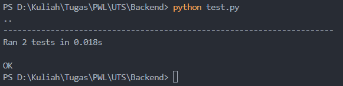

## Ingin melihat hasilnya?
[klik disini](http://rynern.my.id), atau dapat melihat gambar dibawah ini

Register

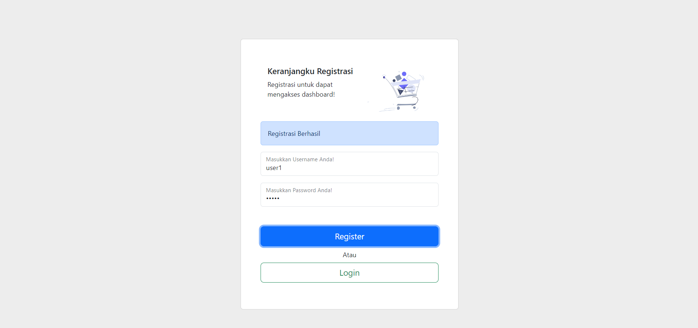

Login ketika Gagal

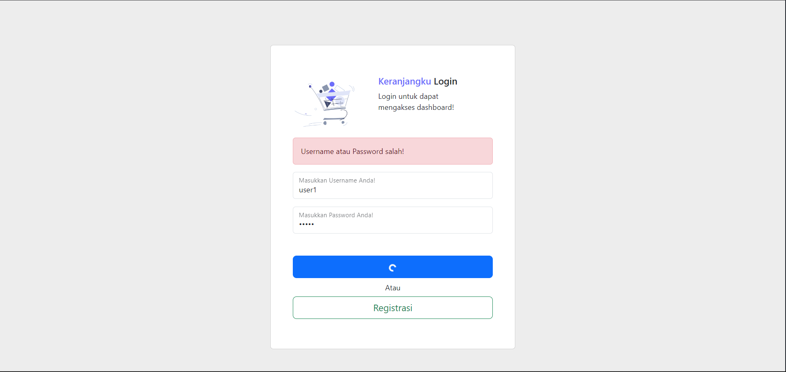

Home

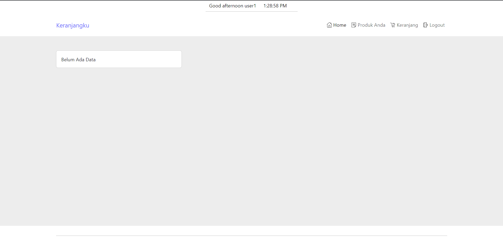

Create Data

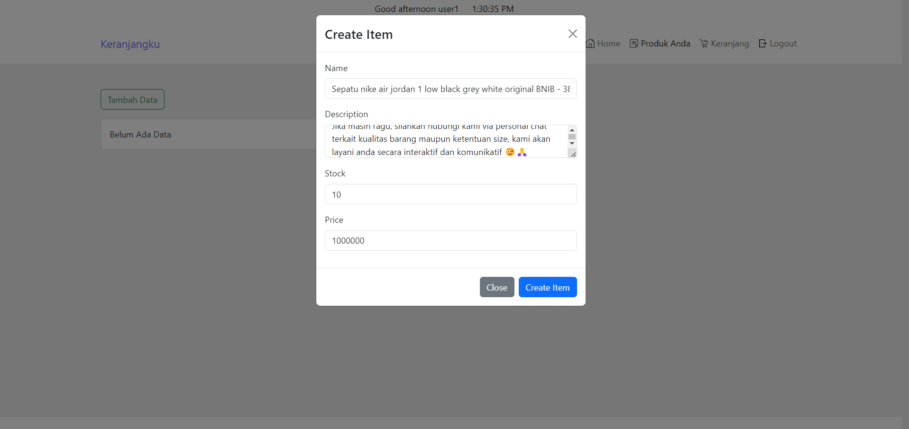

Produk Data yang dibuat pengguna

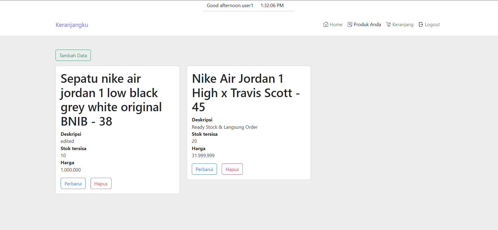

Detail/ Read Data

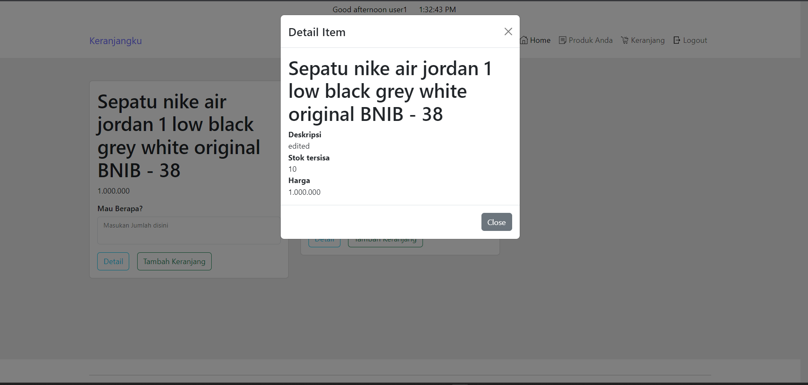

Update Data

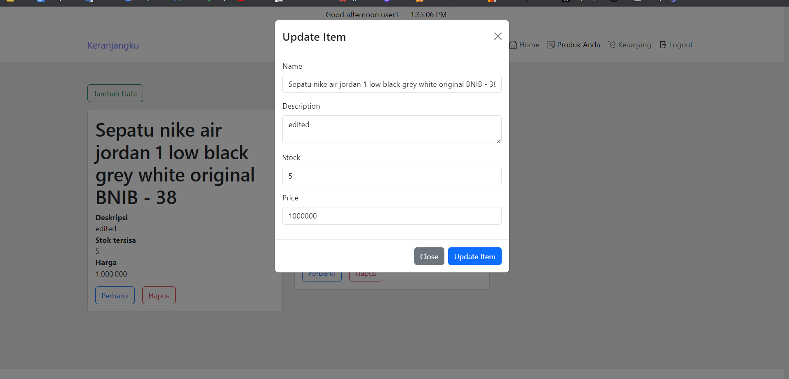

Delete Data

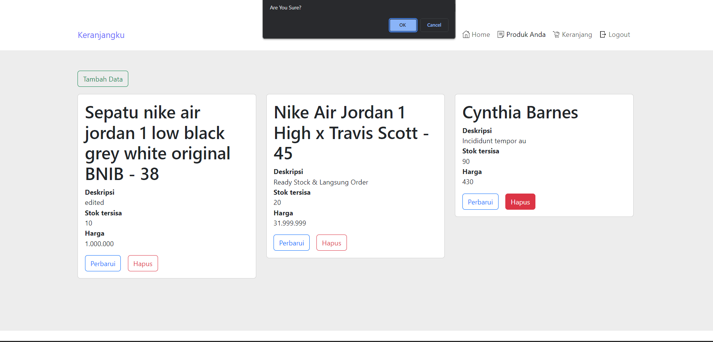

Add Data to Cart

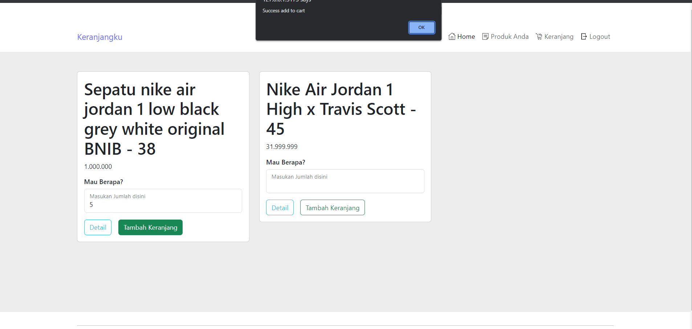

Cart Data

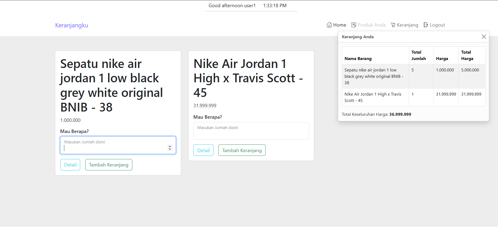

